**UNIVERSIDAD PRIVADA DE TACNA**

**FACULTAD DE INGENIERÍA**

**Escuela Profesional de Ingeniería de Sistemas**

 **Sistema NexusLib**

Curso: Patrones de Software

Docente: Ing. Patrick Cuadros Quiroga

Integrantes:

***Hurtado Ortiz, Leandro			(2015052384)***  
***Flores Navarro, Eduardo Gino		(2023076793)***  
***Cortez Mamani, Julio Samuel		(2023077283)***

**Tacna – Perú**  
**2026**

| CONTROL DE VERSIONES |  |  |  |  |  |
| :---: | :---: | :---: | :---: | :---: | ----- |
| Versión | Hecha por | Revisada por | Aprobada por | Fecha | Motivo |
| 1.0 | LDHO | LDHO | LDHO | 17/04/2026 | Versión Original |
| 2.0 | LDHO | LDHO | LDHO | 19/04/2026 | Versión 2.0 |

# 

# 

# 

# 

# 

# 

# 

# 

# 

# 

# 

**Sistema NexusLib**

**Documento de Especificación de Requerimientos de Software**

# 

**Versión *1.0***

| CONTROL DE VERSIONES |  |  |  |  |  |
| :---: | :---: | :---: | :---: | :---: | ----- |
| Versión | Hecha por | Revisada por | Aprobada por | Fecha | Motivo |
| 1.0 | LDHO | LDHO | LDHO | 17/04/2026 | Versión Original |
| 2.0 | LDHO | LDHO | LDHO | 19/04/2026 | Versión 2.0 |

**ÍNDICE GENERAL**

**[INTRODUCCIÓN	4](#introducción)**

[**I. Generalidades de la Empresa	4**](#i.-generalidades-de-la-empresa)

[1\. Nombre de la Empresa	4](#1.-nombre-de-la-empresa)

[2\. Visión	4](#2.-visión)

[3\. Misión	5](#3.-misión)

[4\. Organigrama	5](#4.-organigrama)

[**II. Visionamiento de la Empresa	5**](#ii.-visionamiento-de-la-empresa)

[1\. Descripción del Problema	5](#1.-descripción-del-problema)

[2\. Objetivos de Negocios	6](#2.-objetivos-de-negocios)

[3\. Objetivos de Diseño	6](#3.-objetivos-de-diseño)

[4\. Alcance del proyecto	7](#4.-alcance-del-proyecto)

[5\. Viabilidad del Sistema	7](#5.-viabilidad-del-sistema)

[6\. Información obtenida del Levantamiento de Información	7](#6.-información-obtenida-del-levantamiento-de-información)

[**III. Análisis de Procesos	8**](#iii.-análisis-de-procesos)

[a) Diagrama del Proceso Propuesto – Diagrama de actividades Inicial	8](#a\)-diagrama-del-proceso-propuesto-–-diagrama-de-actividades-inicial)

[**IV. Especificación de Requerimientos de Software	9**](#iv.-especificación-de-requerimientos-de-software)

[a) Cuadro de Requerimientos No funcionales	9](#a\)-cuadro-de-requerimientos-no-funcionales)

[b) Cuadro de Requerimientos funcionales Final	10](#b\)-cuadro-de-requerimientos-funcionales-final)

[c) Reglas de Negocio	11](#c\)-reglas-de-negocio)

[**V. Fase de Desarrollo	12**](#v.-fase-de-desarrollo)

[1\. Perfiles de Usuario	12](#1.-perfiles-de-usuario)

[2\. Modelo Conceptual	13](#2.-modelo-conceptual)

[a) Diagrama de Paquetes	13](#a\)-diagrama-de-paquetes)

[b) Diagrama de Casos de Uso	14](#b\)-diagrama-de-casos-de-uso)

[c) Escenarios de Caso de Uso (narrativa)	15](#c\)-escenarios-de-caso-de-uso-\(narrativa\))

[3\. Modelo Lógico	22](#3.-modelo-lógico)

[a) Análisis de Objetos	22](#a\)-análisis-de-objetos)

[b) Diagrama de Actividades con objetos	23](#b\)-diagrama-de-actividades-con-objetos)

[c) Diagrama de Secuencia	29](#c\)-diagrama-de-secuencia)

[d) Diagrama de Clases	32](#d\)-diagrama-de-clases)

[**CONCLUSIONES	32**](#conclusiones)

[**RECOMENDACIONES	33**](#recomendaciones)

[**BIBLIOGRAFÍA	33**](#bibliografía)

# **INTRODUCCIÓN** {#introducción}

En el entorno actual de gestión del conocimiento, la eficiencia en la localización de recursos bibliográficos es un factor crítico para el éxito de cualquier proceso de investigación. Sin embargo, la coexistencia de inventarios físicos tradicionales y una creciente oferta de repositorios digitales ha generado una fragmentación de la información, dificultando que los usuarios localicen de manera ágil y precisa el material necesario.

El presente documento de Especificación de Requerimientos de Software (ERS) detalla el diseño y la estructura del Sistema NexusLib, una solución tecnológica orientada a la unificación de servicios bibliotecarios bajo un modelo híbrido. A través de la integración de fuentes externas y la gestión de bases de datos locales, NexusLib ofrece una plataforma centralizada que permite la búsqueda de metadatos, la visualización de la ubicación física exacta de los ejemplares y el acceso directo a recursos digitales.

A lo largo de este informe, se presenta el análisis detallado del sistema mediante el modelado de procesos y la especificación de requerimientos funcionales y no funcionales. El uso de herramientas gráficas y diagramas de arquitectura permite comprender el flujo de datos entre la interfaz de usuario, la lógica de control y las entidades de almacenamiento. Este esfuerzo técnico busca establecer las directrices necesarias para el desarrollo de un software que cumpla con altos estándares de usabilidad, rendimiento y seguridad en la gestión de bibliotecas modernas.

# **I. Generalidades de la Empresa** {#i.-generalidades-de-la-empresa}

## **1\. Nombre de la Empresa** {#1.-nombre-de-la-empresa}

Sistema de Buscador Unificado de Recursos para Bibliotecas Físicas y Virtuales NexusLib

## **2\. Visión** {#2.-visión}

Ser el equipo líder en la provisión de soluciones tecnológicas para la gestión de información académica en la región, reconocidos por la implementación de arquitecturas de software modernas y eficientes que faciliten el acceso democrático al conocimiento.

## **3\. Misión** {#3.-misión}

Desarrollar y desplegar la plataforma NexusLib, utilizando una arquitectura de microservicios y servicios en la nube, para resolver la fragmentación de la información bibliográfica y optimizar los tiempos de investigación de la comunidad universitaria mediante un buscador unificado de alta disponibilidad.

## **4\. Organigrama** {#4.-organigrama}

El organigrama se estructura de la siguiente manera para cubrir todas las áreas del proyecto:

* Director del Proyecto: Responsable de la planificación estratégica y coordinación general.  
* Gestor de Desarrollo (Backend & APIs): Encargado de la lógica de microservicios y la integración con la Google Books API.  
* Líder de Frontend y Calidad (QA): Responsable de la interfaz de usuario, la experiencia de búsqueda (UX) y las pruebas de aseguramiento de calidad.

# **II. Visionamiento de la Empresa** {#ii.-visionamiento-de-la-empresa}

## **1\. Descripción del Problema** {#1.-descripción-del-problema}

Investigar en la institución se ha vuelto un proceso innecesariamente lento y poco efectivo debido a la falta de herramientas tecnológicas integradas. Actualmente, estudiantes y docentes pierden tiempo valioso saltando de un sistema a otro para consultar por separado el inventario de libros físicos y los repositorios digitales, ya que no existe una plataforma que centralice toda la oferta bibliográfica.

Este desorden provoca que muchos recursos digitales que la universidad ya financia se utilicen poco, simplemente porque no son fáciles de localizar en una sola búsqueda. Al no contar con un sistema unificado que informe en tiempo real si un libro está disponible en el estante mientras se explora el material virtual, la investigación se vuelve frustrante y el tiempo invertido no se traduce en un aprendizaje eficiente.

## **2\. Objetivos de Negocios** {#2.-objetivos-de-negocios}

* **Optimización de Activos Institucionales:** Incrementar la tasa de consulta y descarga de recursos digitales mediante su integración en un catálogo unificado, justificando la inversión en suscripciones académicas.  
* **Eficiencia Operativa:** Reducir los tiempos de respuesta del personal bibliotecario al automatizar la consulta de disponibilidad y la localización de materiales físicos.  
* **Modernización Académica:** Posicionar a la facultad como un referente en transformación digital mediante la implementación de herramientas de búsqueda de vanguardia.  
* **Sostenibilidad:** Disminuir los costos operativos asociados a la gestión manual y la impresión de catálogos físicos.

## **3\. Objetivos de Diseño** {#3.-objetivos-de-diseño}

* **Desarrollar una estructura de software modular y escalable**: El sistema se construirá priorizando la flexibilidad del código, lo que permitirá integrar servicios externos de forma limpia y manejar diferentes criterios de búsqueda sin comprometer la estabilidad del núcleo del programa.  
* **Garantizar una experiencia de usuario (UX) centrada en la movilidad**: Se diseñará una interfaz responsiva bajo el estándar *Mobile First*, asegurando que la plataforma sea intuitiva y rápida tanto en estaciones de consulta fijas como en dispositivos móviles.  
* **Desacoplamiento mediante arquitectura de microservicios**: La lógica de negocio se dividirá en componentes independientes para la gestión de inventario físico y recursos digitales. Esto facilita el mantenimiento preventivo y permite que cada módulo crezca de manera independiente según la demanda de los usuarios.  
* **Asegurar la integridad y alta disponibilidad de los datos**: Se empleará un motor de base de datos MySQL optimizado para procesar transacciones en tiempo real, garantizando que la información sobre préstamos y stock bibliográfico esté siempre sincronizada y protegida

## **4\. Alcance del proyecto** {#4.-alcance-del-proyecto}

El proyecto comprende el desarrollo de una plataforma web integral que centralice el acceso a la bibliografía institucional. El alcance incluye la implementación de un buscador unificado capaz de consumir y normalizar metadatos de la Google Books API, vinculándolos en tiempo real con el inventario físico y digital de la facultad. Se desarrollarán módulos para el filtrado avanzado (por ISBN, autor y categorías), una interfaz de usuario responsiva diseñada bajo el estándar Mobile First y un sistema de notificaciones para la gestión de disponibilidad de recursos. El despliegue se realizará en la infraestructura de Azure, garantizando que el sistema sea accesible y funcional para toda la comunidad universitaria. 

## **5\. Viabilidad del Sistema** {#5.-viabilidad-del-sistema}

La viabilidad del proyecto está plenamente respaldada en tres frentes críticos. Desde el aspecto técnico, el equipo posee el dominio necesario del stack PHP 8.2.12 y MySQL, sumado al soporte de servicios en la nube que garantizan estabilidad. En el ámbito económico, el análisis financiero es sólido, presentando un VAN de S/ 4,199.12 y una relación Beneficio/Costo de 1.44, lo que asegura que la inversión de S/ 9,540 es recuperable y rentable. Finalmente, la viabilidad operativa es alta, ya que el sistema se integra a los procesos actuales de la biblioteca sin romper el flujo de trabajo, ofreciendo una herramienta intuitiva que facilita la adopción por parte de alumnos y personal. 

## **6\. Información obtenida del Levantamiento de Información** {#6.-información-obtenida-del-levantamiento-de-información}

Para que el diseño de NexusLib fuera preciso, recolectamos datos directamente de la fuente mediante técnicas de ingeniería de requerimientos. Realizamos entrevistas con el personal bibliotecario para mapear las dificultades actuales en el control de préstamos y la fragmentación de catálogos. Además, aplicamos encuestas a estudiantes para identificar los puntos de frustración más comunes al buscar material académico. Esta información nos permitió priorizar funciones clave, como la visualización unificada de stock y la velocidad de respuesta del buscador, asegurando que la solución técnica resuelva problemas reales detectados durante el análisis de campo. 

# **III. Análisis de Procesos** {#iii.-análisis-de-procesos}

## **a) Diagrama del Proceso Propuesto – Diagrama de actividades Inicial** {#a)-diagrama-del-proceso-propuesto-–-diagrama-de-actividades-inicial}

# **IV. Especificación de Requerimientos de Software** {#iv.-especificación-de-requerimientos-de-software}

## **a) Cuadro de Requerimientos No funcionales** {#a)-cuadro-de-requerimientos-no-funcionales}

| Código | Requerimiento | Descripción |
| :---- | :---- | :---- |
| **RNF-01** | Seguridad | El sistema debe sanear y validar las entradas de búsqueda para prevenir ataques de Inyección SQL y XSS, garantizando la seguridad en un entorno de acceso público y anónimo. |
| **RNF-02** | Rendimiento | El sistema debe estar optimizado para que la integración entre la base de datos local y la fuente externa no afecte la velocidad de respuesta al usuario. |
| **RNF-03** | Disponibilidad | La plataforma debe estar alojada en un servidor web que permita el acceso constante desde cualquier punto de la red universitaria. |
| **RNF-04** | Usabilidad | La interfaz debe ser sencilla y clara, permitiendo que cualquier usuario pueda realizar una búsqueda exitosa sin necesidad de capacitación previa. |

## **b) Cuadro de Requerimientos funcionales Final** {#b)-cuadro-de-requerimientos-funcionales-final}

| Código | Requerimiento | Descripción |
| :---- | :---- | :---- |
| **RF-01** | Búsqueda unificada | El sistema debe realizar consultas simultáneas en el inventario físico (MySQL) y en la Google Books API, presentando los hallazgos en una lista de resultados combinada. |
| **RF-02** | Visualización de detalles | La plataforma debe mostrar la información completa del libro (portada, resumen de Google y datos físicos de la BD) al ser seleccionado desde la lista. |
| **RF-03** | Consulta de disponibilidad | El software debe mostrar en tiempo real si un libro físico se encuentra disponible o prestado según el stock registrado en MySQL. |
| **RF-04** | Filtrado de resultados | La aplicación debe permitir organizar y refinar la lista de libros por criterios de autor, título, categorías o código ISBN. |
| **RF-05** | Localización de recursos | El sistema debe detallar la ubicación exacta (piso y estante) para los libros que se encuentren físicamente en la biblioteca institucional. |
| **RF-06** | Acceso digital | El buscador debe proporcionar enlaces directos para la visualización o descarga de materiales en formato digital cuando el recurso lo permita. |

## **c) Reglas de Negocio** {#c)-reglas-de-negocio}

| Código | Regla de Negocio | Autoridad |
| :---- | :---- | :---- |
| **RN-01** | El sistema debe validar que el campo de búsqueda no esté vacío antes de realizar consultas a la API o base de datos. | Diseño del Sistema |
| **RN-02** | Los resultados de búsqueda deben mostrar primero la disponibilidad física local antes que los recursos externos. | Lógica del Sistema |
| **RN-03** | Un libro se marcará como "No disponible" automáticamente cuando su stock en la base de datos MySQL llegue a cero. | Lógica del Sistema |
| **RN-04** | Las búsquedas por ISBN deben normalizarse para omitir guiones o espacios, validando solo los dígitos numéricos. | Diseño del Sistema |
| **RN-05** | El acceso a la lectura en línea a través de la API de Google estará condicionado a la disponibilidad que otorgue el proveedor externo. | Lógica del Sistema |

# **V. Fase de Desarrollo** {#v.-fase-de-desarrollo}

## **1\. Perfiles de Usuario** {#1.-perfiles-de-usuario}

* **Estudiante / Investigador (Usuario)**

  El usuario principal de la aplicación web es el estudiante o investigador de la comunidad universitaria. Su función consiste en localizar material bibliográfico de manera ágil y sencilla para apoyar su formación académica. El estudiante tiene acceso a un motor de búsqueda unificado donde puede consultar libros mediante el título, autor o código ISBN. El sistema le presentará una lista de resultados que integra tanto el inventario físico de la biblioteca institucional como los recursos digitales globales.

  En la vista detallada de cada libro, el estudiante puede verificar en tiempo real si el ejemplar se encuentra disponible en sala y conocer su ubicación exacta (piso y estante) para su consulta física. Asimismo, en el caso de recursos electrónicos, el usuario cuenta con la opción de acceder a enlaces directos para la lectura en línea o la descarga del material en formato digital, facilitando así el acceso a la información desde cualquier dispositivo con conexión a internet.

## **2\. Modelo Conceptual** {#2.-modelo-conceptual}

### **a) Diagrama de Paquetes** {#a)-diagrama-de-paquetes}

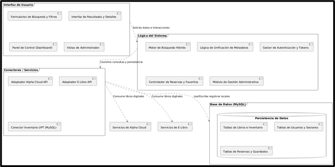

El sistema se divide en cuatro bloques: Interfaz para la interacción del usuario, Lógica para procesar las búsquedas, Conectores para fuentes externas y la Base de Datos para el almacenamiento de la información institucional. Esta organización separa las vistas de los datos para un desarrollo más ordenado.

### **b) Diagrama de Casos de Uso** {#b)-diagrama-de-casos-de-uso}

### 

### 

### 

### 

### **c) Escenarios de Caso de Uso (narrativa)** {#c)-escenarios-de-caso-de-uso-(narrativa)}

**Narrativa de CU01 \- Búsqueda Unificada**

| RF-01: Búsqueda unificada |  |
| ----- | ----- |
| **Tipo** | Obligatorio |
| **Actores** | Usuario, Sistema NexusLib, Google Books API |
| **Descripción** | Permite al usuario realizar consultas simultáneas en el inventario físico institucional y en la base de datos externa de Google Books. |
| **Precondiciones** | El sistema debe contar con conexión a internet para acceder a la API externa. |
| **Narrativa de cada de uso** |  |
| **Acción del usuario** | **Respuesta del sistema** |
| 1\. El usuario ingresa un término de búsqueda (título, autor o ISBN) en la barra principal. |  |
| 2\. El usuario presiona el botón de "Buscar" o la tecla Enter para confirmar la consulta. | 3\. El sistema recibe el parámetro y activa la exploración simultánea en la base de datos MySQL y la API de Google. |
|  |  |
|  | 4\. El sistema procesa ambas fuentes, unifica la información y elimina posibles resultados duplicados. |
|  | 5\. El sistema organiza los hallazgos priorizando aquellos libros que cuentan con ejemplares físicos disponibles en sala. |
|  | 6\. El sistema despliega la lista combinada de resultados en la interfaz de usuario. |

**Narrativa de CU02 \- Visualización de Detalles**

| RF-02: Visualización de detalles |  |
| ----- | ----- |
| **Tipo** | Obligatorio |
| **Actores** | Usuario, Sistema NexusLib, Google Books API |
| **Descripción** | Permite al usuario ver la ficha completa de un libro, combinando la información de la biblioteca y los metadatos de Google. |
| **Precondiciones** | El usuario debe haber realizado una búsqueda previa y seleccionado un elemento de la lista. |
| **Narrativa de cada de uso** |  |
| **Acción del usuario** | **Respuesta del sistema** |
| 1\. El usuario hace clic sobre un libro específico en la lista de resultados. | 2\. El sistema identifica el recurso y solicita los metadatos extendidos (como portada y resumen) a la API de Google. |
|  | 3\. El sistema recupera de forma simultánea los datos de ubicación y estado físico desde la base de datos MySQL. |
|  | 4\. El sistema integra y estructura toda la información obtenida en una sola vista detallada. |
| 5\. El usuario visualiza la información completa del recurso (portada, sinopsis y datos físicos). | 6\. El sistema presenta la ficha activa y habilita las opciones para localizar el libro o acceder al material digital. |

**Narrativa de CU03 \- Consulta de Disponibilidad**

| RF-03: Consulta de disponibilidad |  |
| ----- | ----- |
| **Tipo** | Obligatorio |
| **Actores** | Usuario, Sistema NexusLib |
| **Descripción** | Permite al usuario verificar en tiempo real si un ejemplar físico está disponible para préstamo basándose en el stock registrado en la base de datos. |
| **Precondiciones** | El libro debe existir en el inventario de la base de datos institucional (MySQL). |
| **Narrativa de cada de uso** |  |
| **Acción del usuario** | **Respuesta del sistema** |
| 1\. El usuario accede a la sección de estado dentro de la ficha detallada del libro. | 2\. El sistema ejecuta una consulta al campo "stock" de la tabla de inventario correspondiente en MySQL. |
|  | 3\. El sistema valida si la cantidad de ejemplares es superior a cero para determinar el estado actual. |
| 4\. El usuario observa el indicador de disponibilidad en la interfaz. | 5\. El sistema muestra de resultado la cantidad de stock disponible y si no hay stock muestra mensaje de “Sin stock actual”. |

**Narrativa de CU04 \- Filtrado de Resultados**

| RF-04: Filtrado de resultados |  |
| ----- | ----- |
| **Tipo** | Obligatorio |
| **Actores** | Usuario, Sistema NexusLib |
| **Descripción** | Permite al usuario refinar y organizar la lista de resultados mediante filtros de origen (físico/digital), criterios de ordenamiento y estado de disponibilidad. |
| **Precondiciones** | El usuario debe contar con una lista de resultados de búsqueda activa en pantalla. |
| **Narrativa de cada de uso** |  |
| **Acción del usuario** | **Respuesta del sistema** |
| 1\. El usuario selecciona el origen del recurso (Todos, Solo Físicos o Solo Digitales) en el desplegable "Origen". | 2\. El sistema filtra la lista actual para mostrar únicamente los recursos que coinciden con la fuente seleccionada. |
| 3\. El usuario elige un criterio de organización (Relevancia o Título A-Z) en el desplegable "Orden". | 4\. El sistema reordena automáticamente los elementos de la lista en pantalla según la prioridad establecida. |
| 5\. El usuario activa el interruptor de "Solo disponibles". | 6\. El sistema oculta temporalmente los libros físicos que no cuentan con stock registrado en la base de datos MySQL.  |

**Narrativa de CU05 \- Localización de Recursos**

| RF-05: Localización de recursos |  |
| ----- | ----- |
| **Tipo** | Obligatorio |
| **Actores** | Usuario, Sistema NexusLib |
| **Descripción** | Detalla al usuario la ubicación física exacta (piso y estante) y proporciona instrucciones de orientación para encontrar el libro en la sala. |
| **Precondiciones** | El recurso seleccionado debe estar registrado como un ejemplar físico con stock disponible en la base de datos MySQL. |
| **Narrativa de cada de uso** |  |
| **Acción del usuario** | **Respuesta del sistema** |
| 1\. El usuario ingresa a la vista de detalles de un libro que cuenta con ejemplares locales. | 2\. El sistema recupera los datos de ubicación (piso y estante) desde la tabla de inventario en MySQL. |
|  | 3\. El sistema habilita el panel destacado "¿Dónde encontrarlo físicamente?" dentro de la interfaz. |
| 4\. El usuario visualiza la ubicación exacta y lee la instrucción de guía proporcionada. | 5\. El sistema presenta un mensaje de orientación textual (ej: "Dirígete al Piso X y busca el estante Y") para facilitar la búsqueda física en la biblioteca. |

**Narrativa de CU06 \- Acceso Digital**

| RF-06: Acceso digital |  |
| ----- | ----- |
| **Tipo** | Obligatorio |
| **Actores** | Usuario, Sistema NexusLib, Google Books API |
| **Descripción** | Proporciona al usuario enlaces directos para la visualización de materiales en línea cuando el recurso cuenta con una versión digital disponible. |
| **Precondiciones** | El recurso debe contar con un enlace (URL) de vista previa válido proporcionado por la API de Google o el repositorio institucional. |
| **Narrativa de cada de uso** |  |
| **Acción del usuario** | **Respuesta del sistema** |
| 1\. El usuario identifica y hace clic en el botón de "Leer Vista Previa" en la lista de resultados de búsqueda. | 2\. El sistema redirecciona al usuario a la ficha técnica o vista de detalles del libro seleccionado. |
| 3\. El usuario presiona el botón de "Recurso Digital" dentro de la sección de detalles del libro. | 4\. El sistema abre automáticamente una nueva pestaña en el navegador con el visor del recurso digital correspondiente. |

## **3\. Modelo Lógico** {#3.-modelo-lógico}

### **a) Análisis de Objetos** {#a)-análisis-de-objetos}

| Interfaz | Control | Entidad |
| :---- | :---- | :---- |
| Buscador Principal | Motor de Búsqueda Híbrido | Base de Datos |
| Vista de Detalles | Lógica de Unificación (API/DB) | Google Books API |
| Panel de Resultados | Lógica de Filtrado |  |
|  | Lógica de Inventario |  |
|  | Gestor de Acceso Digital |  |
|  | Adaptador Google Books |  |

### **b) Diagrama de Actividades con objetos** {#b)-diagrama-de-actividades-con-objetos}

**RF-01: Búsqueda Unificada**

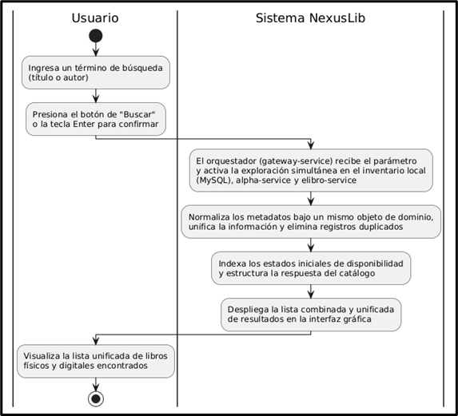

**RF-02: Visualización de Detalles**

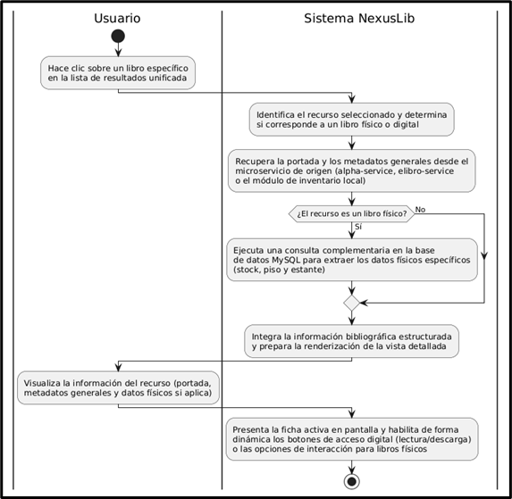

**RF-03: Consulta de Disponibilidad**

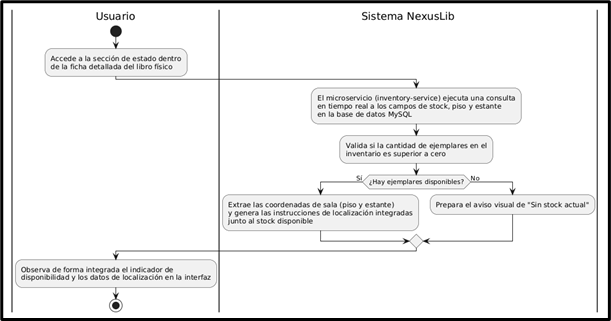

**RF-04: Filtrado de Resultados**

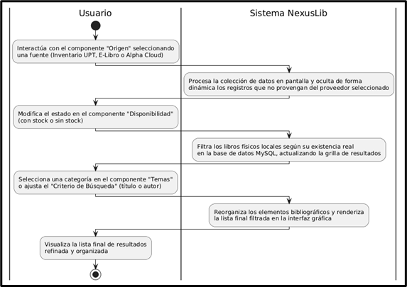

**RF-05: Localización de Recursos**

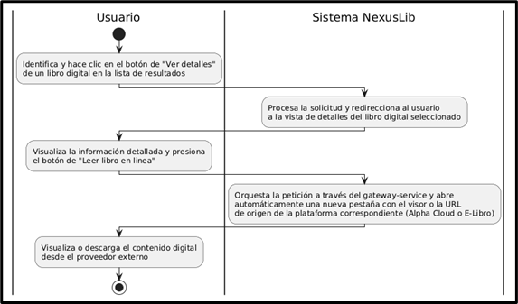

**RF-06: Acceso Digital**

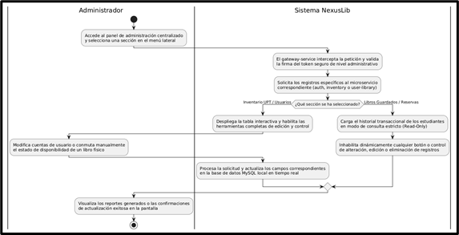

### 

### 

### 

### 

### **c) Diagrama de Secuencia** {#c)-diagrama-de-secuencia}

**RF-01: Búsqueda Unificada**

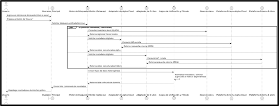

**RF-02: Visualización de Detalles**

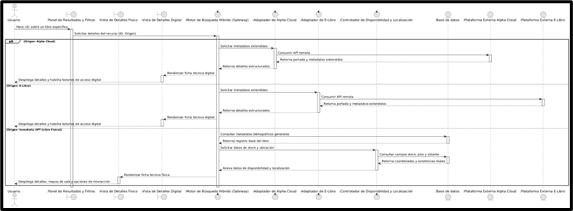

**RF-03: Consulta de Disponibilidad**

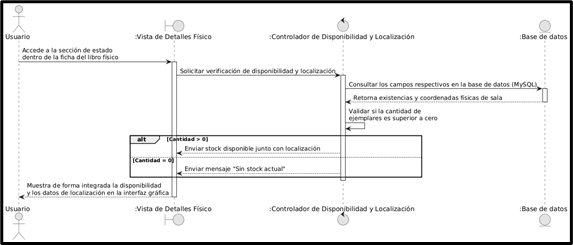

**RF-04: Filtrado de Resultados**

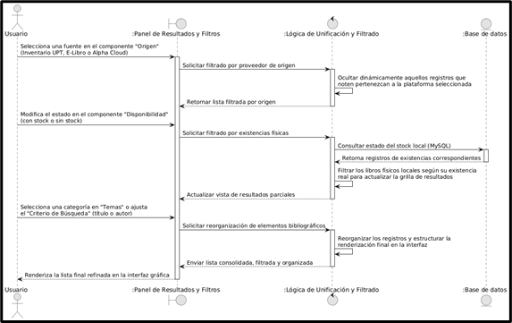

**RF-05: Localización de Recursos**

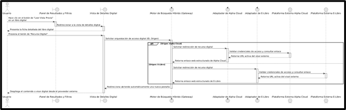

**RF-06: Acceso Digital**

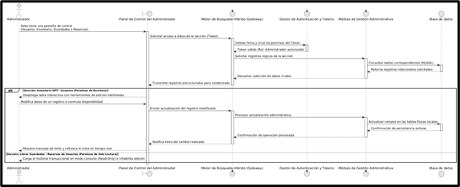

### **d) Diagrama de Clases** {#d)-diagrama-de-clases}

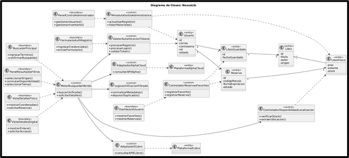

# **CONCLUSIONES** {#conclusiones}

El presente documento de Especificación de Requerimientos de Software (ERS) ha permitido estructurar de manera clara y detallada los requisitos del Sistema NexusLib , estableciendo una base sólida para su desarrollo e implementación bajo una arquitectura modular y escalable. A través del análisis del problema de fragmentación bibliográfica , la identificación de perfiles de usuario como el estudiante e investigador , y la especificación de los siete requerimientos funcionales y cuatro no funcionales , se ha logrado definir un sistema eficiente que centraliza la oferta académica institucional. Además, la representación gráfica mediante diagramas de casos de uso , actividades con objetos , secuencia y clases ha facilitado la comprensión técnica del flujo de datos entre la interfaz de usuario, la lógica de búsqueda híbrida y la base de datos MySQL. Con esta documentación, se garantiza que el desarrollo del software esté alineado con los objetivos de modernización académica y eficiencia operativa planteados , asegurando un acceso optimizado y democrático al conocimiento para toda la comunidad universitaria.

# **RECOMENDACIONES** {#recomendaciones}

* **Escalabilidad de Fuentes:** Se recomienda continuar con la integración de nuevas APIs de repositorios académicos adicionales para expandir aún más el alcance del catálogo digital unificado.  
* **Mantenimiento Preventivo:** Es fundamental establecer un cronograma de mantenimiento preventivo para el módulo de base de datos MySQL, asegurando que la sincronización del stock y la integridad de los datos de préstamos se mantengan en tiempo real.  
* **Fomento del Consumo Digital:** Se sugiere promover el uso de las funciones de acceso digital para incrementar la tasa de consulta de los recursos ya financiados por la universidad, optimizando así el retorno de la inversión en suscripciones académicas.  
* **Monitoreo de Infraestructura:** Se recomienda monitorear constantemente el desempeño del despliegue en la infraestructura de Azure para garantizar que la plataforma mantenga los estándares de disponibilidad RNF-03 requeridos por la red universitaria.  
* **Capacitación Continua:** Aunque el sistema está diseñado para ser intuitivo (RNF-04), se recomienda realizar breves sesiones informativas con el personal bibliotecario para maximizar el uso de las herramientas de localización física y gestión de disponibilidad.

# **BIBLIOGRAFÍA** {#bibliografía}

* **Sánchez-Tarragó, N., & Alfonso-Sánchez, I. R. (2005).** *Biblioteca híbrida: el bibliotecario en medio del tránsito de lo tradicional a lo moderno*. E-LIS Repository. [http://eprints.rclis.org/6474/1/Biblioteca\_hibrida.pdf](http://eprints.rclis.org/6474/1/Biblioteca_hibrida.pdf)  
* **Guerrero-Cedeño, M., & et al. (2025).** *Sistemas integrados de gestión bibliotecaria en universidades: una revisión sistemática*. Dialnet. [https://dialnet.unirioja.es/descarga/articulo/10442413.pdf](https://dialnet.unirioja.es/descarga/articulo/10442413.pdf)  
* **Daramola, C. F. (2025).** *Exploring the impact of Digital and Physical Resources on Accessibility and Efficiency in College Libraries*. ResearchGate. [https://www.researchgate.net/publication/390300560\_Exploring\_the\_impact\_of\_Digital\_and\_Physical\_Resources](https://www.google.com/search?q=https://www.researchgate.net/publication/390300560_Exploring_the_impact_of_Digital_and_Physical_Resources)
