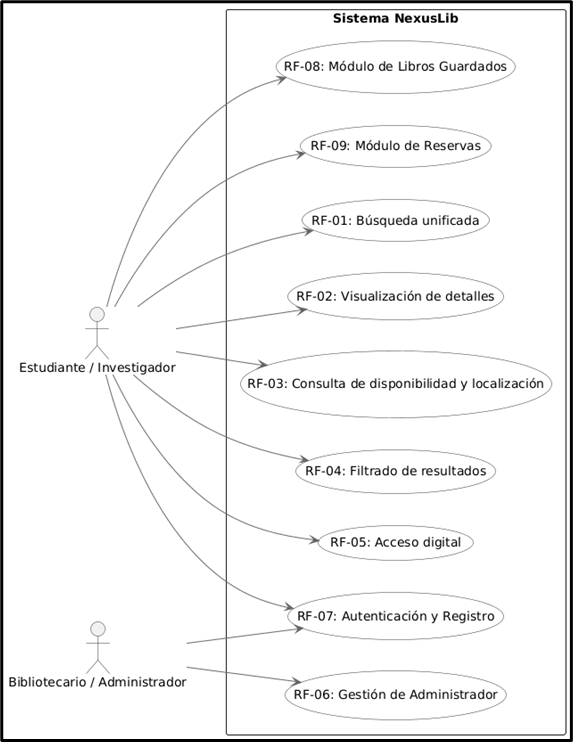
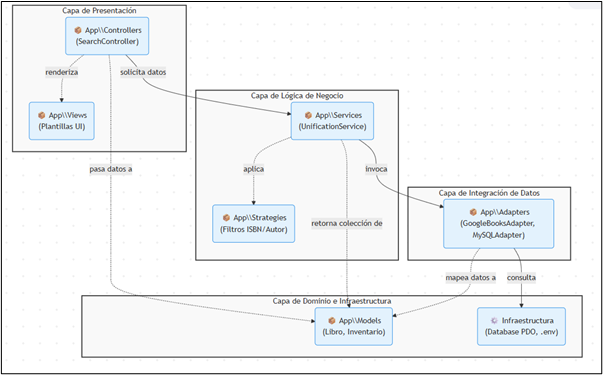
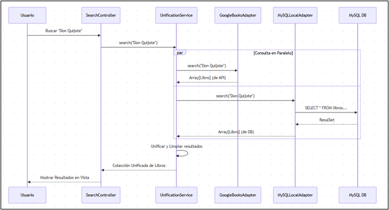
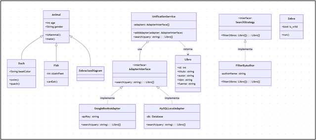
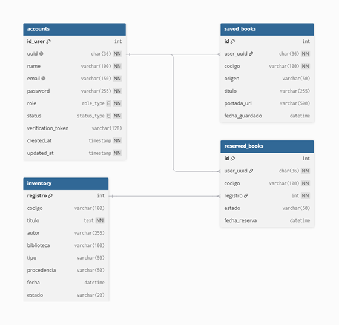
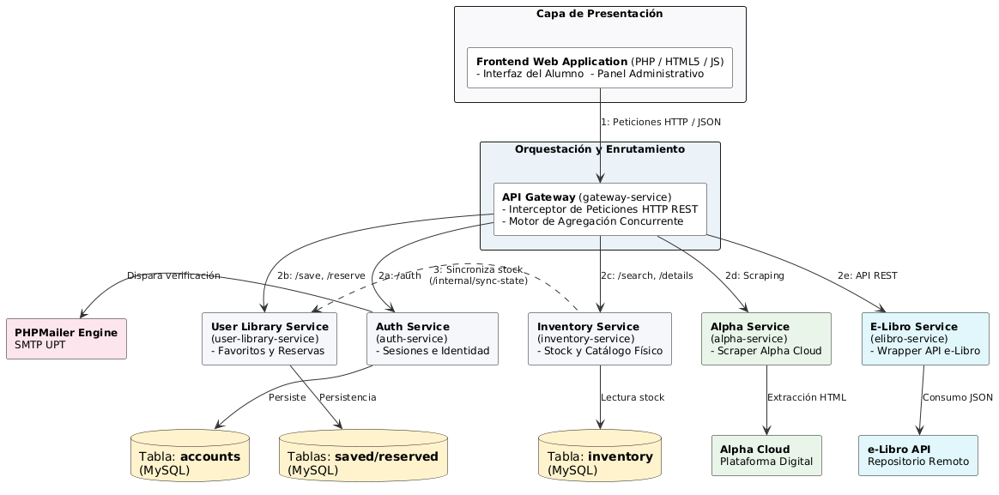
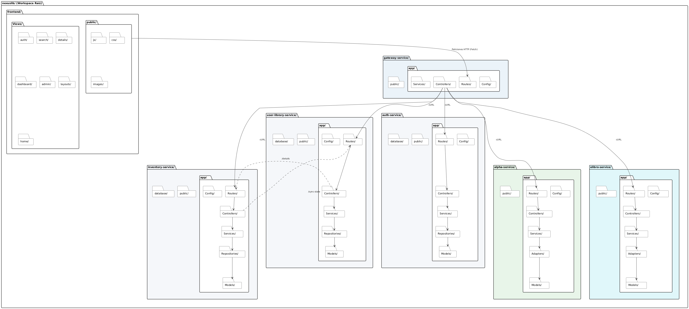
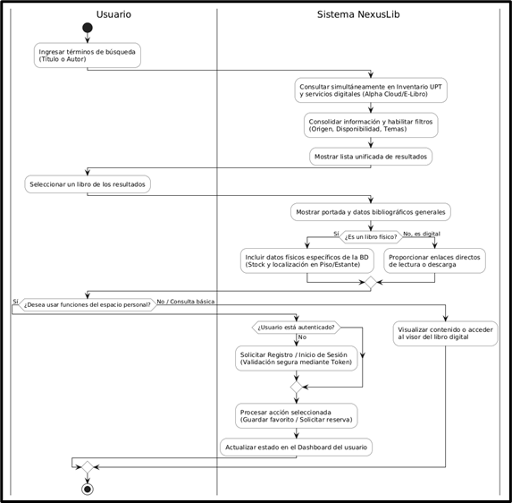

**UNIVERSIDAD PRIVADA DE TACNA**

**FACULTAD DE INGENIERIA**

**Escuela Profesional de Ingeniería de Sistemas**

 **Sistema NexusLib**

Curso: Patrones de Software

Docente: Ing. Patrick Cuadros Quiroga

Integrantes:

***Hurtado Ortiz, Leandro			(2015052384)***  
***Flores Navarro, Eduardo Gino		(2023076793)***  
***Cortez Mamani, Julio Samuel		(2023077283)***

**Tacna – Perú**  
***2026***

| CONTROL DE VERSIONES |  |  |  |  |  |
| :---: | :---: | :---: | :---: | :---: | ----- |
| Versión | Hecha por | Revisada por | Aprobada por | Fecha | Motivo |
| 1.0 | EGFN-JSCM | EGFN-JSCM | LDHO | 20/04/2026 | Versión Original |

# 

# 

# 

# 

# 

# 

# 

# 

# **Sistema NexusLib**

# **Documento de Arquitectura de Software**

# 

# **Versión *1.0***

| CONTROL DE VERSIONES |  |  |  |  |  |
| :---: | :---: | :---: | :---: | :---: | ----- |
| Versión | Hecha por | Revisada por | Aprobada por | Fecha | Motivo |
| 1.0 | EGFN-JSCM | EGFN-JSCM | LDHO | 20/04/2026 | Versión Original |

**ÍNDICE GENERAL**

**Contenido**

[1\. INTRODUCCIÓN	4](#1.-introducción)

[1.1. Propósito (Diagrama 4+1)	4](#1.1.-propósito-\(diagrama-4+1\))

[1.2. Alcance	4](#1.2.-alcance)

[1.3. Definición, siglas y abreviaturas	5](#1.3.-definición,-siglas-y-abreviaturas)

[1.4. Organización del documento	6](#1.4.-organización-del-documento)

[2\. OBJETIVOS Y RESTRICCIONES ARQUITECTÓNICAS	6](#2.-objetivos-y-restricciones-arquitectónicas)

[2.1. Priorización de requerimientos	6](#2.1.-priorización-de-requerimientos)

[2.1.1. Requerimientos Funcionales	7](#2.1.1.-requerimientos-funcionales)

[2.1.2. Requerimientos No Funcionales – Atributos de Calidad	8](#2.1.2.-requerimientos-no-funcionales-–-atributos-de-calidad)

[2.2. Restricciones	9](#2.2.-restricciones)

[3\. REPRESENTACIÓN DE LA ARQUITECTURA DEL SISTEMA	9](#3.-representación-de-la-arquitectura-del-sistema)

[3.1. Vista de Caso de uso	9](#3.1.-vista-de-caso-de-uso)

[3.1.1. Caso de Uso Principal: Búsqueda Unificada de Libros	9](#3.1.1.-caso-de-uso-principal:-búsqueda-unificada-de-libros)

[3.1.2 Caso de Uso: Filtrado Avanzado de Resultados	11](#3.1.2-caso-de-uso:-filtrado-avanzado-de-resultados)

[3.1.3. Diagramas de Casos de uso	11](#3.1.3.-diagramas-de-casos-de-uso)

[3.2. Vista Lógica	12](#3.2.-vista-lógica)

[3.2.1. Diagrama de Subsistemas (paquetes)	12](#3.2.1.-diagrama-de-subsistemas-\(paquetes\))

[3.2.2. Diagrama de Secuencia (vista de diseño)	14](#3.2.2.-diagrama-de-secuencia-\(vista-de-diseño\))

[3.2.3. Diagrama de Colaboración (vista de diseño)	15](#3.2.3.-diagrama-de-colaboración-\(vista-de-diseño\))

[3.2.4. Diagrama de Clases	15](#3.2.4.-diagrama-de-clases)

[3.2.5. Diagrama Base de datos	15](#3.2.5.-diagrama-base-de-datos)

[3.3. Vista de Implementación (vista de desarrollo)	16](#3.3.-vista-de-implementación-\(vista-de-desarrollo\))

[3.3.1. Diagrama de arquitectura software (paquetes)	16](#3.3.1.-diagrama-de-arquitectura-software-\(paquetes\))

[3.3.2. Diagrama de arquitectura del sistema (Diagrama de componentes)	17](#3.3.2.-diagrama-de-arquitectura-del-sistema-\(diagrama-de-componentes\))

[3.4. Vista de procesos	18](#3.4.-vista-de-procesos)

[3.4.1. Diagrama de Procesos del sistema (diagrama de actividad)	20](#3.4.1.-diagrama-de-procesos-del-sistema-\(diagrama-de-actividad\))

[3.5. Vista de Despliegue (vista física)	21](#3.5.-vista-de-despliegue-\(vista-física\))

[3.5.1. Diagrama de despliegue	21](#3.5.1.-diagrama-de-despliegue)

[4\. ATRIBUTOS DE CALIDAD DEL SOFTWARE	23](#4.-atributos-de-calidad-del-software)

[4.1. Escenario de Funcionalidad	23](#4.1.-escenario-de-funcionalidad)

[4.2. Escenario de Usabilidad	24](#4.2.-escenario-de-usabilidad)

[4.3. Escenario de confiabilidad	25](#4.3.-escenario-de-confiabilidad)

[4.4. Escenario de rendimiento	26](#4.4.-escenario-de-rendimiento)

[4.5. Escenario de mantenibilidad	27](#4.5.-escenario-de-mantenibilidad)

[4.6. Otros Escenarios: Escalabilidad	29](#4.6.-otros-escenarios:-escalabilidad)

# **1\. INTRODUCCIÓN** {#1.-introducción}

## **1.1. Propósito (Diagrama 4+1)** {#1.1.-propósito-(diagrama-4+1)}

El propósito de este documento es definir la arquitectura de NexusLib, un sistema unificado de gestión bibliográfica. El diseño se fundamenta en el modelo de 4+1 vistas, priorizando la extensibilidad y la mantenibilidad sobre la optimización extrema de recursos.

* Visión Global: El sistema permite la coexistencia de múltiples fuentes de datos (Google Books API y MySQL Local) de forma transparente para el usuario.  
* Trade-off (Decisiones): Se ha priorizado la Portabilidad y Desacoplamiento (mediante el uso de *Adapters* y *Strategies*) sacrificando una mínima latencia que podría introducir la capa de abstracción. Esto asegura que añadir una nueva fuente de libros no requiera modificar la lógica de negocio central.

## **1.2. Alcance** {#1.2.-alcance}

Este documento se centra primordialmente en la Vista Lógica del framework, detallando la interacción entre los adaptadores de búsqueda y los servicios de unificación.

* Incluido: Diagramas de clases, definición de interfaces de estrategia, modelos de datos y la arquitectura del servicio de unificación.  
* Excluido: Se omite la *Vista de Procesos*, dado que NexusLib opera bajo un flujo de ejecución síncrono estándar de petición-respuesta (HTTP), y no presenta concurrencia compleja o estados de hilos que requieran un análisis detallado en esta fase.

 

## **1.3. Definición, siglas y abreviaturas** {#1.3.-definición,-siglas-y-abreviaturas}

| Término | Definición |
| :---: | :---: |
| Adapter | Patrón de diseño estructural que permite a objetos con interfaces incompatibles colaborar entre sí. |
| API | *Application Programming Interface*. Interfaz que permite la comunicación con servicios externos (ej. Google Books). |
| ISBN | *International Standard Book Number*. Identificador único comercial para libros. |
| MVC | *Model-View-Controller*. Patrón de arquitectura que separa la lógica de negocio, los datos y la interfaz de usuario. |
| PDO | *PHP Data Objects*. Extensión que define una interfaz ligera y consistente para acceder a bases de datos en PHP. |
| Strategy | Patrón de diseño de comportamiento que permite seleccionar un algoritmo (filtro) en tiempo de ejecución. |

## **1.4. Organización del documento** {#1.4.-organización-del-documento}

El resto del documento se estructura de la siguiente manera:

1. Vista Lógica: Detalle de clases, interfaces y el corazón del patrón Strategy/Adapter.  
2. Vista de Desarrollo: Organización del código en el sistema de archivos (Composer, src/, public/).  
3. Vista Física: Requerimientos del entorno (PHP 8.x, Servidor MySQL, conexión a internet para APIs).  
4. Escenarios: Casos de uso principales, como la búsqueda unificada y el almacenamiento de favoritos.

# **2\. OBJETIVOS Y RESTRICCIONES ARQUITECTÓNICAS** {#2.-objetivos-y-restricciones-arquitectónicas}

Esta sección establece el orden de ejecución y las reglas de juego para el desarrollo. La prioridad se ha asignado considerando que la unificación de fuentes es el núcleo de valor de NexusLib.

## **2.1. Priorización de requerimientos** {#2.1.-priorización-de-requerimientos}

La estrategia de implementación sigue un orden lógico: primero la conectividad (fuentes de datos), luego el procesamiento (unificación) y finalmente la optimización (filtros y UI).

### **2.1.1. Requerimientos Funcionales** {#2.1.1.-requerimientos-funcionales}

| ID | Requerimiento | Descripción | Prioridad |
| ----- | ----- | ----- | ----- |
| **RF-01** | Búsqueda unificada | El sistema debe realizar consultas simultáneas en el inventario físico (MySQL) y en la Google Books API, presentando los hallazgos en una lista de resultados combinada. | Alta |
| **RF-02** | Visualización de detalles | La plataforma debe mostrar la información completa del libro (portada, resumen de Google y datos físicos de la BD) al ser seleccionado desde la lista. | Alta |
| **RF-03** | Consulta de disponibilidad | El software debe mostrar en tiempo real si un libro físico se encuentra disponible o prestado según el stock registrado en MySQL. | Alta |
| **RF-04** | Filtrado de resultados | La aplicación debe permitir organizar y refinar la lista de libros por criterios de autor, título, categorías o código ISBN. | Media |
| **RF-05** | Localización de recursos | El sistema debe detallar la ubicación exacta (piso y estante) para los libros que se encuentren físicamente en la biblioteca institucional. | Media |
| **RF-06** | Acceso digital | El buscador debe proporcionar enlaces directos para la visualización o descarga de materiales en formato digital cuando el recurso lo permita. | Media |
| **RF-07** | Gestión de inventario | El sistema debe permitir la administración integral (crear, leer, actualizar y eliminar) de los registros bibliográficos del inventario físico local almacenados en la base de datos institucional. | Media |

### 

### **2.1.2. Requerimientos No Funcionales – Atributos de Calidad** {#2.1.2.-requerimientos-no-funcionales-–-atributos-de-calidad}

| ID | Atributo de Calidad | Descripción | Prioridad |
| :---: | :---: | :---: | :---: |
| RNF01 | Extensibilidad | El sistema debe permitir añadir nuevos adaptadores de libros (ej. OpenLibrary) sin modificar el servicio de unificación. | Alta |
| RNF02 | Modularidad | Separación clara entre la lógica de acceso a datos, lógica de negocio y presentación (siguiendo MVC). | Alta |
| RNF03 | Interoperabilidad | Capacidad de transformar formatos JSON (API) y registros SQL en objetos Libro consistentes. | Media |
| RNF04 | Configurabilidad | Gestión de credenciales y entornos mediante archivos .env para facilitar el despliegue. | Media |
| RNF05 | Disponibilidad | El sistema debe manejar errores gracefully si una fuente externa (API) no responde. | Baja |

## 

## **2.2. Restricciones** {#2.2.-restricciones}

* **Lenguaje**: El sistema debe desarrollarse estrictamente en PHP 8.x.  
* **Patrones Obligatorios**: El uso de Adapter para fuentes de datos y Strategy para filtros no es opcional, ya que garantiza el cumplimiento del RNF01.  
* **Persistencia**: Se debe utilizar PDO para asegurar que el sistema sea compatible con diferentes motores de base de datos en el futuro, aunque actualmente use MySQL.

# **3\. REPRESENTACIÓN DE LA ARQUITECTURA DEL SISTEMA** {#3.-representación-de-la-arquitectura-del-sistema}

## **3.1. Vista de Caso de uso** {#3.1.-vista-de-caso-de-uso}

Esta vista describe las funcionalidades centrales desde la perspectiva del usuario y cómo los componentes arquitectónicos colaboran para satisfacerlas.

### **3.1.1. Caso de Uso Principal: Búsqueda Unificada de Libros** {#3.1.1.-caso-de-uso-principal:-búsqueda-unificada-de-libros}

Este escenario es el más crítico, ya que involucra la integración de múltiples fuentes de datos, el uso de adaptadores y la lógica de unificación.

**A. Flujo de Eventos \- Diseño (Descripción Textual)**

1. **Activación**: El usuario ingresa un término de búsqueda en la interfaz web (search/index.php).  
2. **Delegación**: El SearchController recibe la petición y, en lugar de consultar una base de datos directamente, invoca al UnificationService.  
3. **Colaboración de Adaptadores**: El UnificationService recorre una lista de objetos que implementan la AdapterInterface.  
   * El GoogleBooksAdapter realiza una petición HTTP a la API externa y mapea el JSON resultante a objetos de la clase Libro.  
   * El MySQLLocalAdapter ejecuta una consulta SQL a la base de datos local y transforma las filas en objetos Libro.  
4. **Consolidación**: El UnificationService mezcla ambas colecciones, eliminando duplicados si fuera necesario, y devuelve un array único de objetos Libro.  
5. **Presentación**: El controlador envía la lista unificada a la Vista para su renderizado.

**B. Diagramas de Interacción y Objetos Participantes** Para que este caso de uso funcione, los siguientes objetos deben colaborar:

| Objeto Participante | Rol en la Arquitectura |
| :---: | :---: |
| SearchController | Orquestador de la petición; comunica la vista con el servicio. |
| UnificationService | Sujeto Arquitectónico Central. Implementa la lógica de agregación. |
| GoogleBooksAdapter | Adaptador externo; gestiona la comunicación con la API de Google. |
| MySQLLocalAdapter | Adaptador local; gestiona la comunicación con MariaDB/MySQL. |
| Libro | Entidad de datos (POPO); estandariza el formato de información en todo el sistema. |

**C. Requisitos Derivados (No Funcionales de la Realización)** Durante la implementación de este caso de uso, se deben garantizar los siguientes puntos:

* **Tolerancia a Fallos**: Si la API de Google Books falla (timeout o falta de internet), el caso de uso debe completarse mostrando únicamente los resultados locales sin lanzar una excepción fatal.  
* **Abstracción de Datos**: Ningún componente por encima de los Adaptadores debe saber de dónde provienen los datos (encapsulamiento).  
* **Rendimiento**: El tiempo de respuesta total no debe exceder el tiempo de respuesta de la fuente más lenta (normalmente la API externa).

### **3.1.2 Caso de Uso: Filtrado Avanzado de Resultados** {#3.1.2-caso-de-uso:-filtrado-avanzado-de-resultados}

Este escenario justifica la implementación del patrón Strategy.

* **Descripción**: Una vez obtenidos los resultados unificados, el usuario aplica filtros (por ISBN o Autor).  
* **Realización**: El sistema utiliza objetos como FilterByAuthor que implementan SearchStrategy. Esto permite que el motor de búsqueda sea "cerrado a modificaciones pero abierto a nuevas estrategias de filtrado" (Principio Solid OCP).

### **3.1.3. Diagramas de Casos de uso** {#3.1.3.-diagramas-de-casos-de-uso}

**Actores Principal y Secundario**:

* **Usuario**: Interactúa con el sistema para buscar libros y ver detalles.  
* **Administrador**: Tiene los mismos permisos que el usuario, pero con la capacidad adicional de gestionar el inventario local (Agregar, editar, eliminar libros físicos o locales).

**Actores Externos**:

* **Google Books API**: Actúa como un actor externo que provee información al caso de uso de consulta externa.  
* **MySQL Local**: Representa la persistencia de datos del sistema.

**Relaciones Clave**:

* **\<\<include\>\>**: La *Búsqueda Unificada* invoca obligatoriamente a *Consultar Fuente Externa* (Google Books) y *Consultar Fuente Local* (MySQL) para poder funcionar.  
* **\<\<extend\>\>**: *Aplicar Filtros por ISBN/Autor* es una funcionalidad opcional que amplía la búsqueda general sólo cuando el usuario lo decide (representando nuestro patrón Strategy).

## **3.2. Vista Lógica** {#3.2.-vista-lógica}

La vista lógica se encarga de representar cómo se estructuran los componentes internos del sistema para satisfacer los requerimientos funcionales. En NexusLib, el diseño se basa en una arquitectura por capas fundamentada en el patrón MVC (Modelo-Vista-Controlador), enriquecida con los patrones Adapter y Strategy para garantizar el bajo acoplamiento y la alta cohesión.

### **3.2.1. Diagrama de Subsistemas (paquetes)** {#3.2.1.-diagrama-de-subsistemas-(paquetes)}

El sistema se descompone lógicamente en paquetes (o namespaces) que representan las distintas capas de responsabilidad de la aplicación. Esta separación permite que, por ejemplo, la interfaz de usuario pueda cambiar sin afectar la lógica de unificación, o que se agreguen nuevas fuentes de datos sin alterar los controladores.

A continuación, se describen los paquetes principales del sistema:

1. **Capa de Presentación (App\\Controllers y App\\Views)**:  
   * Gestiona las peticiones HTTP del usuario, delega el procesamiento a la capa de negocio y renderiza los resultados.  
2. **Capa de Lógica de Negocio (App\\Services y App\\Strategies)**:  
   * Contiene el UnificationService, que actúa como el motor principal del sistema coordinando las búsquedas.  
   * El paquete Strategies encapsula los algoritmos de filtrado (por Autor, por ISBN) que se aplican a los resultados en tiempo de ejecución.  
3. **Capa de Integración de Datos (App\\Adapters)**:  
   * Abstrae la complejidad de las fuentes de datos. Todos los adaptadores (GoogleBooksAdapter, MySQLLocalAdapter) implementan una interfaz común, aislando al sistema de las particularidades de las APIs externas o motores SQL.  
4. **Capa de Dominio (App\\Models)**:  
   * Contiene las entidades de negocio centrales, como Libro e Inventario. Son objetos de transferencia de datos (DTOs/POPOs) que unifican la estructura de la información en todo el sistema.  
5. **Capa de Infraestructura**:  
   * Maneja las conexiones de bajo nivel, como la clase Database (PDO) y la configuración de variables de entorno.

### **3.2.2. Diagrama de Secuencia (vista de diseño)** {#3.2.2.-diagrama-de-secuencia-(vista-de-diseño)}

### **3.2.3. Diagrama de Colaboración (vista de diseño)** {#3.2.3.-diagrama-de-colaboración-(vista-de-diseño)}

### **3.2.4. Diagrama de Clases** {#3.2.4.-diagrama-de-clases}

### **3.2.5. Diagrama Base de datos** {#3.2.5.-diagrama-base-de-datos}

## **3.3. Vista de Implementación (vista de desarrollo)** {#3.3.-vista-de-implementación-(vista-de-desarrollo)}

Esta vista describe la organización de los artefactos de software en el entorno de desarrollo. Mapea las clases y servicios de la Vista Lógica a archivos reales en el sistema de archivos.

### **3.3.1. Diagrama de arquitectura software (paquetes)** {#3.3.1.-diagrama-de-arquitectura-software-(paquetes)}

Este diagrama detalla cómo se distribuye el código fuente en capas físicas. Cada paquete aquí representa un directorio en el proyecto nexuslib/*.*  

### **3.3.2. Diagrama de arquitectura del sistema (Diagrama de componentes)** {#3.3.2.-diagrama-de-arquitectura-del-sistema-(diagrama-de-componentes)}

Detalle de los Componentes:

1. Motor de Unificación (UnificationService): Es el componente central. No conoce los detalles de las bases de datos ni de las APIs; solo conoce la AdapterInterface.  
2. Adaptadores: Son componentes "enchufables". Puedes desconectar el GoogleAdapter o conectar un OpenLibraryAdapter sin que el motor de unificación sufra cambios.  
3. Cargador de Clases (Composer): Un componente de infraestructura crítico que gestiona la carga de todas las piezas anteriores de forma eficiente.  
4. Interfaces: Las interfaces (representadas por el círculo/semicírculo) son los contratos que permiten que los componentes se comuniquen sin estar acoplados rígidamente.

| Elemento Lógico | Componente de Implementación | Ubicación en Disco |
| :---- | :---- | :---- |
| **Controlador** | SearchController.php | src/Controllers/ |
| **Servicio de Unificación** | UnificationService.php | src/Services/ |
| **Adaptador Externo** | GoogleBooksAdapter.php | src/Adapters/ |
| **Estrategia de Filtro** | FilterByAuthor.php | src/Strategies/ |
| **Configuración de DB** | Database.php | src/Config/ |

## **3.4. Vista de procesos** {#3.4.-vista-de-procesos}

Esta vista describe la ejecución del sistema. Aunque NexusLib es una aplicación PHP (que tradicionalmente sigue un modelo de ejecución por petición), existen procesos pesados y comunicaciones entre procesos (IPC) y redes que deben coordinarse.

Procesos Principales:

* Servidor Web (Apache/Nginx): Proceso padre que escucha peticiones HTTP.  
* PHP-FPM (Procesamiento): Conjunto de procesos trabajadores que ejecutan el código de NexusLib. Cada búsqueda unificada activa un hilo de ejecución que gestiona la memoria para los objetos Libro.  
* Motor de Base de Datos (MySQL): Proceso independiente que gestiona la persistencia y la concurrencia de datos.

Modos de Comunicación:

* Síncrona (Bloqueante): La comunicación entre el Servicio de Unificación y los Adaptadores es síncrona; el proceso PHP espera la respuesta de la Google Books API para continuar.  
* TCP/IP: Comunicación con el motor MySQL (puerto 3306\) y con la API externa (puerto 443).

### **3.4.1. Diagrama de Procesos del sistema (diagrama de actividad)** {#3.4.1.-diagrama-de-procesos-del-sistema-(diagrama-de-actividad)}

## **3.5. Vista de Despliegue (vista física)** {#3.5.-vista-de-despliegue-(vista-física)}

La vista de despliegue muestra la asignación del software a los nodos de hardware y contenedores. Representa cómo se distribuye NexusLib en un entorno de producción real.

Arquitectura de Despliegue

El sistema se distribuye típicamente en una arquitectura de tres capas: Cliente (Navegador), Servidor de Aplicaciones y Servicios Externos.

* Nodo Cliente: Cualquier dispositivo con un navegador moderno que soporte CSS/JS.  
* Nodo de Servidor (Linux/Docker):  
* Contenedor App: Aloja el código PHP 8.x, Composer y el servidor web.  
* Contenedor DB: Base de datos MySQL persistente.  
* Nodos Externos: Servidores de Google (API) accesibles vía Internet.

### **3.5.1. Diagrama de despliegue** {#3.5.1.-diagrama-de-despliegue}

**Descripción de la infraestructura:**

1. **Aislamiento**: El uso de contenedores permite que la base de datos y la aplicación escalen de forma independiente.  
2. **Seguridad**: La comunicación entre PHP y MySQL ocurre dentro de una red privada de Docker, mientras que la comunicación con el cliente y Google está cifrada mediante TLS.  
3. **Persistencia**: El nodo de MySQL utiliza volúmenes de datos para asegurar que los libros locales no se pierdan al reiniciar el contenedor.

 

| Vista | Enfoque | Artefacto Clave |
| :---: | :---: | :---: |
| **Lógica** | Funcionalidad | Diagrama de Clases (Adapters/Strategy) |
| **Implementación** | Organización | Estructura de carpetas src/ y vendor/ |
| **Procesos** | Rendimiento/Flujo | Diagrama de Actividad (Unificación) |
| **Despliegue** | Topología Física | Nodos Docker y Google API |

# 

# **4\. ATRIBUTOS DE CALIDAD DEL SOFTWARE** {#4.-atributos-de-calidad-del-software}

Los atributos de calidad en NexusLib representan los pilares no funcionales que aseguran que el sistema no solo "funcione", sino que sea robusto, intuitivo y profesional.

## **4.1. Escenario de Funcionalidad** {#4.1.-escenario-de-funcionalidad}

La funcionalidad en NexusLib se centra en la capacidad de entregar resultados precisos y seguros, independientemente de la complejidad de las fuentes de datos.

| Elemento | Descripción |
| :---: | :---: |
| **Atributo** | **Integridad y Capacidad de Búsqueda** |
| **Estímulo** | El usuario realiza una búsqueda de un título que existe tanto en la API externa como en la DB local. |
| **Fuente del Estímulo** | Usuario final a través de la interfaz de búsqueda. |
| **Entorno** | Operación normal del sistema con conexión a internet activa. |
| **Respuesta** | El UnificationService consolida ambos resultados, elimina duplicados y presenta una ficha técnica completa. |
| **Medida de Respuesta** | El 100% de los campos críticos (Título, Autor, ISBN) deben mostrarse correctamente sin pérdida de datos en la transformación del Adaptador. |

**Seguridad General:** El sistema implementa limpieza de entradas (*sanitization*) en el SearchController para prevenir ataques de Inyección SQL y XSS, garantizando que las funciones de búsqueda sean seguras para la infraestructura

## **4.2. Escenario de Usabilidad** {#4.2.-escenario-de-usabilidad}

Este atributo mide qué tan rápido un bibliotecario o usuario común puede dominar el framework sin entrenamiento previo.

| Elemento | Descripción |
| :---: | :---: |
| Atributo | Aprendizaje y Eficiencia de Uso |
| Estímulo | Un usuario nuevo intenta filtrar una lista de 50 libros por un autor específico. |
| Fuente del Estímulo | Usuario sin capacitación previa en el sistema. |
| Entorno | Interfaz de resultados de búsqueda. |
| Respuesta | El sistema debe ofrecer controles de filtrado claros (Strategy Pattern) que actúen de forma instantánea. |
| Medida de Respuesta | El usuario debe ser capaz de encontrar y aplicar el filtro en menos de 10 segundos. Los mensajes de error (en caso de no haber resultados) deben ser descriptivos y no técnicos. |

## **4.3. Escenario de confiabilidad** {#4.3.-escenario-de-confiabilidad}

Este atributo garantiza que el sistema permanezca operativo y que la información sea íntegra, incluso ante fallos de servicios externos o intentos de acceso no autorizados.

| Elemento | Descripción |
| :---: | :---: |
| **Atributo** | **Disponibilidad y Tolerancia a Fallos** |
| **Estímulo** | La API de Google Books queda fuera de servicio o devuelve un error 500 durante una búsqueda. |
| **Fuente del Estímulo** | Red externa / Servicio de terceros. |
| **Entorno** | Operación normal con alta demanda. |
| **Respuesta** | El adaptador externo captura la excepción (catch), registra el error y permite que el proceso continúe con los resultados de la base de datos local. |
| **Medida de Respuesta** | El sistema debe mostrar los resultados locales en menos de 2 segundos sin interrumpir la sesión del usuario ni mostrar errores de código en pantalla. |

## **4.4. Escenario de rendimiento** {#4.4.-escenario-de-rendimiento}

El rendimiento mide la eficiencia del sistema bajo carga, optimizando el uso de recursos del servidor y los tiempos de espera del usuario.

| Elemento | Descripción |
| :---: | :---: |
| **Atributo** | **Tiempo de Respuesta y Eficiencia** |
| **Estímulo** | Un usuario realiza una búsqueda masiva que devuelve más de 100 resultados combinados. |
| **Fuente del Estímulo** | Usuario final. |
| **Entorno** | Carga estándar en el servidor de aplicaciones PHP. |
| **Respuesta** | El UnificationService procesa las colecciones en memoria y aplica los filtros de búsqueda. |
| **Medida de Respuesta** | La página de resultados debe cargarse en menos de 800ms (excluyendo el tiempo de respuesta de la API externa), manteniendo el uso de memoria RAM por debajo de los 32MB por petición. |

## **4.5. Escenario de mantenibilidad** {#4.5.-escenario-de-mantenibilidad}

La mantenibilidad es el punto más fuerte de **NexusLib** gracias al uso de interfaces y el desacoplamiento de capas.

| Elemento | Descripción |
| :---: | :---: |
| **Atributo** | **Extensibilidad y Adaptabilidad** |
| **Estímulo** | Se requiere cambiar el motor de base de datos de MySQL a PostgreSQL. |
| **Fuente del Estímulo** | Administrador de infraestructura / Desarrollador. |
| **Entorno** | Fase de actualización del sistema. |
| **Respuesta** | Se modifica únicamente el componente Database.php y se ajusta el MySQLLocalAdapter (ahora PostgreAdapter). |
| **Medida de Respuesta** | El cambio no debe afectar al controlador ni a la lógica de unificación. El tiempo de refactorización se reduce al mínimo gracias a la interfaz AdapterInterface. |

## **4.6. Otros Escenarios: Escalabilidad** {#4.6.-otros-escenarios:-escalabilidad}

Es vital considerar cómo el sistema se comporta ante el crecimiento del volumen de datos.

| Elemento | Descripción |
| :---: | :---: |
| **Atributo** | **Escalabilidad de Datos** |
| **Estímulo** | La base de datos local de inventario crece de 1,000 a 1,000,000 de registros. |
| **Fuente del Estímulo** | Crecimiento orgánico del catálogo. |
| **Entorno** | Base de datos en producción. |
| **Respuesta** | Los índices definidos en el schema.sql y las consultas optimizadas en el adaptador local mantienen la velocidad de respuesta. |
| **Medida de Respuesta** | El tiempo de búsqueda en la fuente local no debe degradarse más de un 10% respecto al tiempo inicial tras el crecimiento de la data. |
